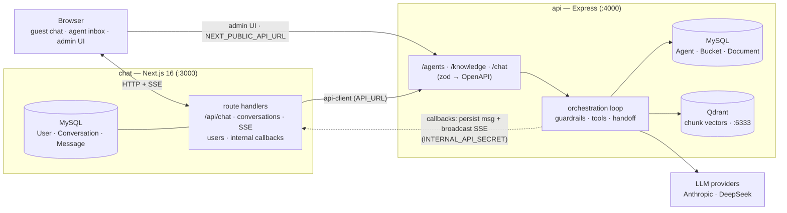

# Agent Routing — monorepo

Multi-agent chat where guests talk to AI **or** human agents, with routing/handoff
between them. Split into two independently-deployable services plus a generated
client, in a pnpm workspace.

```
packages/
  chat/        Next.js 16 app — chat UI + real-time backend
               (/api/chat streaming, conversations, SSE, messages,
                claim/close/escalate, users). Owns MySQL: User/Conversation/Message.
  api/         Express service — the AI Config API: agents CRUD + knowledge/RAG
               (buckets, documents, search). Owns MySQL: Agent + knowledge
               registry (buckets/documents). Owns the Qdrant vector store
               (chunk vectors). Routes are described with zod and emitted as
               an OpenAPI 3.0 spec (openapi.json).
  api-client/  TypeScript client generated from api/openapi.json
               (openapi-typescript + openapi-fetch). Consumed by chat.
```

## Architecture

The chat service does **not** share a database with the API service. It loads
agent config from the API over HTTP via the generated, typed `api-client`
(orchestration loads the active agent per turn; the admin UI manages agents and
knowledge; `search_knowledge` calls the API's retrieval pipeline). Cross-service
references (`Conversation.currentAgentId`, `Message.authorAgentId`) are plain
string ids — the agent's display name is denormalized onto those rows so chat
history renders without a cross-service call. See [`DESIGN.md`](DESIGN.md) for
the architecture and [`tasks/`](tasks/) for the milestone-by-milestone build log.



## Prerequisites

- Node 20+, pnpm
- Docker (for Qdrant + MySQL)
- `DEEPSEEK_API_KEY` (and/or `ANTHROPIC_API_KEY`) in `packages/api/.env` and
  `packages/chat/.env` (see the `.env` files for all keys).

## Setup

```bash
pnpm install

# Databases
docker compose up -d                 # Qdrant (:6333) + MySQL (:3307)
pnpm --filter @agent-routing/api  exec prisma migrate dev   # Agent + knowledge registry DB
pnpm --filter @agent-routing/chat exec prisma migrate dev   # User/Conversation/Message DB
pnpm rag:setup                       # verify Qdrant + bootstrap bucket collections

# Seed
pnpm db:seed                         # 3 AI agents (api) + 1 human operator (chat)
pnpm rag:seed                        # optional: demo hotel knowledge base

# Generate the API spec + client (after changing the API's zod schemas)
pnpm api:openapi                     # api/openapi.json
pnpm api-client:generate             # api-client/src/schema.d.ts
```

## Run

```bash
pnpm dev          # runs both services (chat :3000, api :4000)
# or individually:
pnpm dev:api      # http://localhost:4000  (docs: /docs, spec: /openapi.json)
pnpm dev:chat     # http://localhost:3000
```

The chat service reaches the API via `API_URL` (server-side) and
`NEXT_PUBLIC_API_URL` (browser); CORS is enabled on the API.
