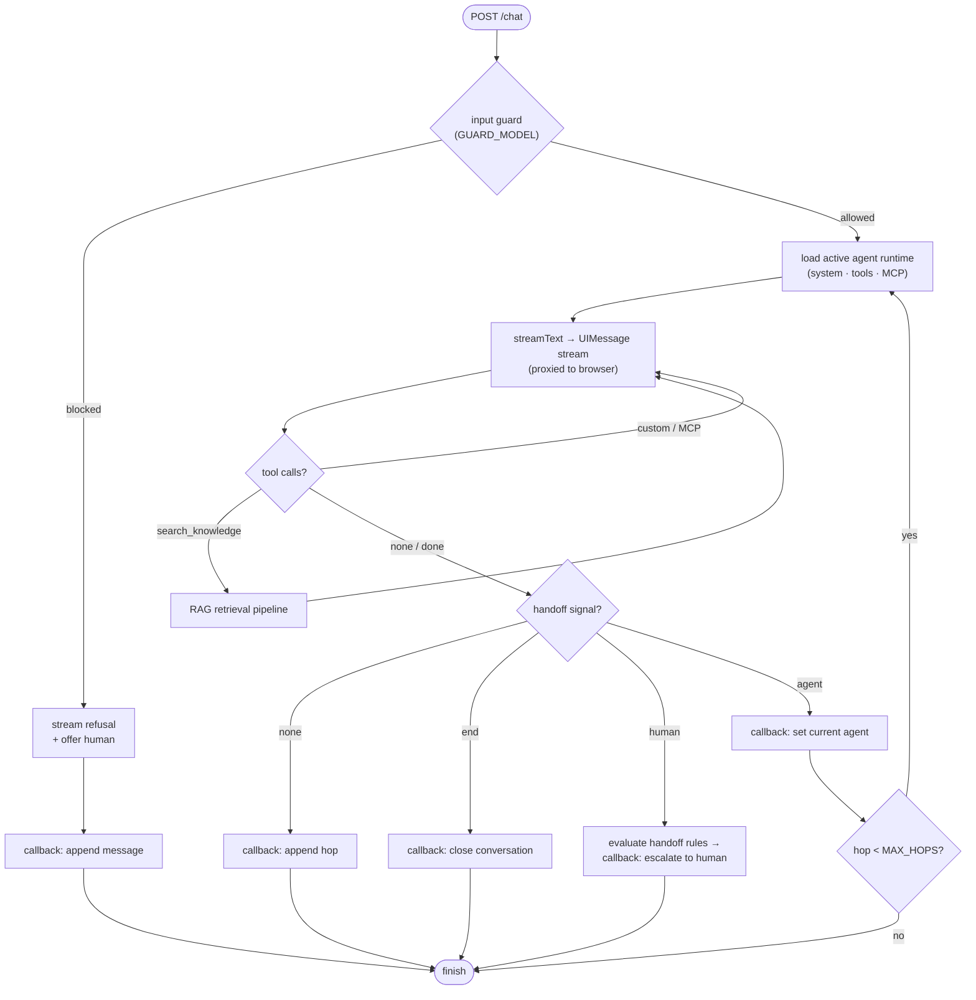
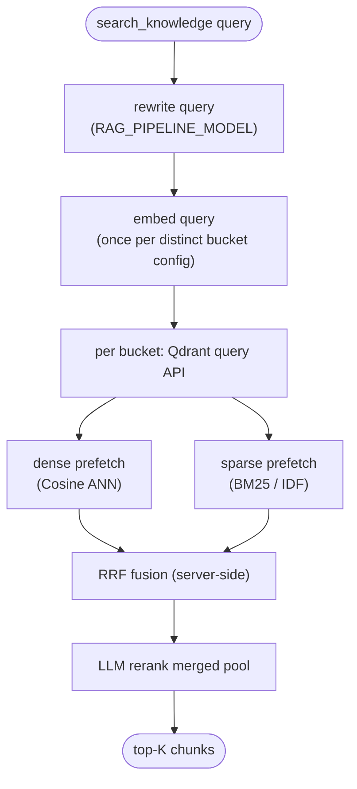

# @agent-routing/api

The **AI Config API** — an Express service that owns everything about the AI
side of the product: agent definitions, the AI orchestration/turn engine, input
guardrails, and the RAG knowledge base. The [chat](../chat) service consumes it
over HTTP through the generated [api-client](../api-client). Routes are described
with zod and emitted as an OpenAPI 3.0 spec.

## What it owns

- **Agents** — CRUD over agent config: model, system prompt, builtin tool flags,
  custom tools, MCP servers, handoff rules, guardrails, knowledge config.
  (`src/routes/agents.ts`, persisted in the agent SQLite DB.)
- **Orchestration** — runs a conversation turn for the active agent: tool calls,
  `search_knowledge` retrieval, handoff, streaming. (`src/lib/agents/`,
  `src/routes/chat.ts`.) Persists messages + broadcasts SSE by calling the chat
  service's internal callback endpoint.
- **Guardrails** — input classifier that screens user turns before the model
  runs. (`src/lib/agents/guard.ts`, `GUARD_MODEL`.)
- **Knowledge / RAG** — buckets, documents, chunking, embeddings, query rewrite,
  retrieval + reranking. (`src/routes/knowledge.ts`, `src/lib/rag/`.)

Everything is tenant-scoped. This service holds every tenant's data in one DB;
the tenant is resolved per request — admin/RAG routes via the `X-Tenant-Id`
header, `/chat` via the request body, the OpenAI facade via the Bearer key.
Tenants are created at runtime by the chat app's sign-up and registered here via
the secret-gated `POST /internal/tenants`.

## Turn flow

A single chat turn runs the orchestration loop: input guardrail → stream the
active agent → it may call tools (`search_knowledge`, custom, MCP) or hand off,
up to `MAX_HOPS` agent hops. Each hop is persisted and conversation-state
changes are pushed back to the chat service via callbacks.



## RAG retrieval

`search_knowledge` runs a hybrid pipeline (`src/lib/rag/retrieve.ts`): rewrite
the query, then per bucket run Qdrant **native hybrid** search — a dense
(semantic, Cosine) and a sparse (keyword/IDF) prefetch fused server-side with
Reciprocal Rank Fusion — and LLM-rerank the merged top pool. Buckets embed with
their own pinned provider, so the query is embedded once per distinct config.
Sparse vectors are produced locally by a small BM25 tokenizer (`lib/rag/sparse.ts`)
and weighted by Qdrant's `idf` modifier — no FTS column, no separate model.



## Infrastructure

| Concern        | Tech                                                                 |
| -------------- | -------------------------------------------------------------------- |
| Runtime        | Node 20+, Express 5, `tsx` (dev: `tsx watch`)                        |
| Agent + registry | MySQL via Prisma 7 (`@prisma/adapter-mariadb`) — `DATABASE_URL` (Agent, Bucket, Document) |
| RAG vectors    | Qdrant via `@qdrant/js-client-rest` — `QDRANT_URL` (collection per tenant+bucket) |
| AI SDK         | Vercel AI SDK v6 (`@ai-sdk/anthropic`, `@ai-sdk/deepseek`, `@ai-sdk/mcp`) |
| Embeddings     | `local` (`@huggingface/transformers`, bge-small, 384d) / `openai` / `voyage` |
| API surface    | zod schemas → OpenAPI 3.0 (`openapi.json`), Redoc at `/docs`         |

The relational DB (MySQL: agents + knowledge registry) and the vector store
(Qdrant: chunk vectors) are **separate**. Both are provided by the root
[`docker-compose.yml`](../../docker-compose.yml) — Qdrant (REST host port
**6333**) and MySQL (host port **3307**, `agents` database).

## Endpoints

- `GET /health`
- `GET /openapi.json`, `GET /docs` (Redoc)
- `/agents` — agent CRUD
- `/knowledge` — buckets, documents, search
- `/chat` — orchestration / turn engine

Default port **4000** (`API_PORT`).

## Setup

```bash
cp .env.example .env                 # fill in DEEPSEEK_API_KEY / ANTHROPIC_API_KEY
pnpm install
docker compose -f ../../docker-compose.yml up -d   # Qdrant (:6333) + MySQL (:3307)
pnpm exec prisma migrate dev         # agent + knowledge registry DB (MySQL)
pnpm rag:setup                       # verify Qdrant + bootstrap bucket collections
pnpm db:seed                         # 3 demo AI agents
pnpm rag:seed                        # optional demo knowledge base
```

## Scripts

```bash
pnpm dev          # tsx watch src/server.ts  → http://localhost:4000
pnpm start        # run once (no watch)
pnpm build        # prisma generate + tsc --noEmit
pnpm openapi      # regenerate ../api/openapi.json from the zod schemas
pnpm rag:setup    # verify Qdrant + bootstrap bucket collections
pnpm rag:seed     # seed the demo knowledge base
pnpm db:seed      # seed agents
```

After changing the zod route schemas, run `pnpm openapi` then regenerate the
client (`pnpm --filter @agent-routing/api-client generate`).

## Environment

See [`.env.example`](.env.example) for the full annotated list. Key vars:
`DATABASE_URL`, `API_PORT`, `CORS_ORIGIN`, `INTERNAL_API_SECRET`,
`CHAT_URL`, `ANTHROPIC_API_KEY`, `DEEPSEEK_API_KEY`, `GUARD_MODEL`,
`QDRANT_URL` (+ optional `QDRANT_API_KEY`), `EMBEDDING_PROVIDER`
(+ `OPENAI_API_KEY` / `VOYAGE_API_KEY`).
