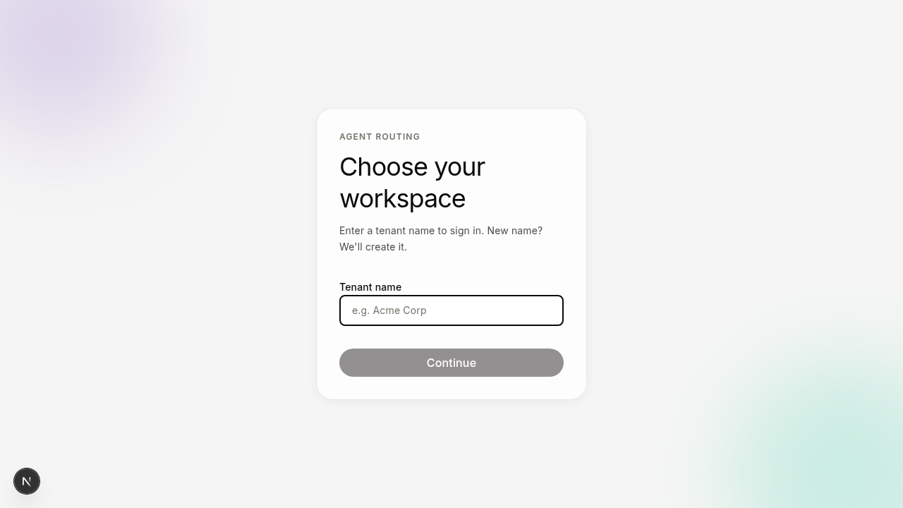
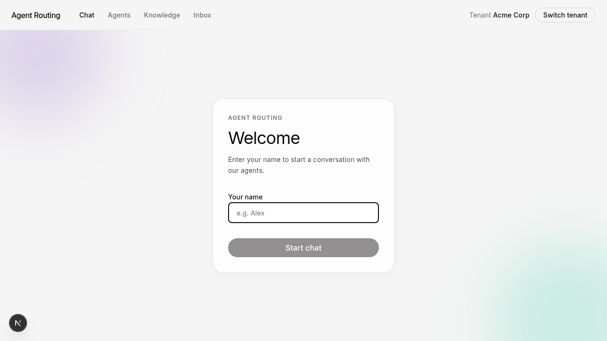
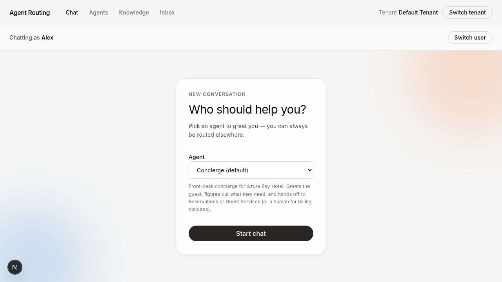
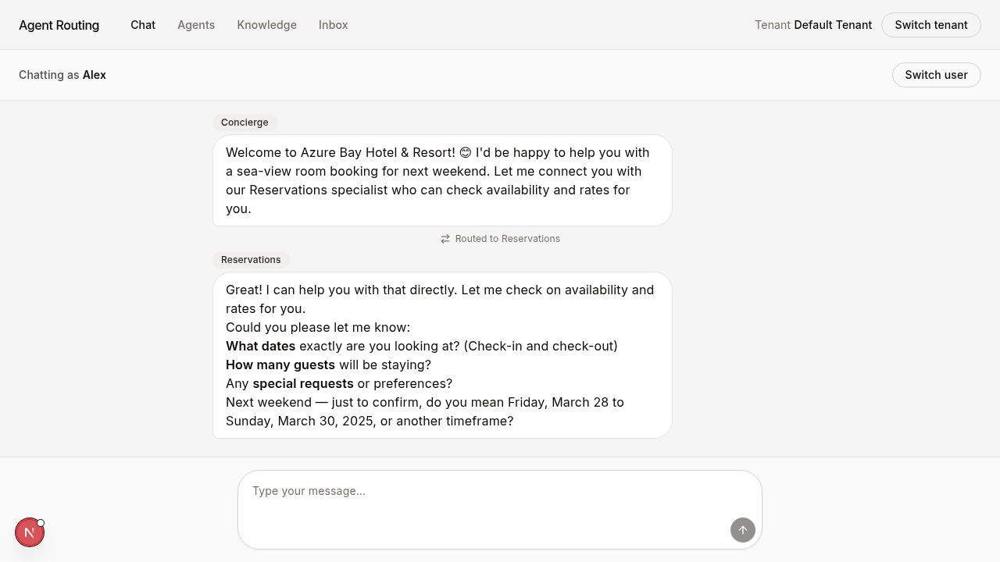
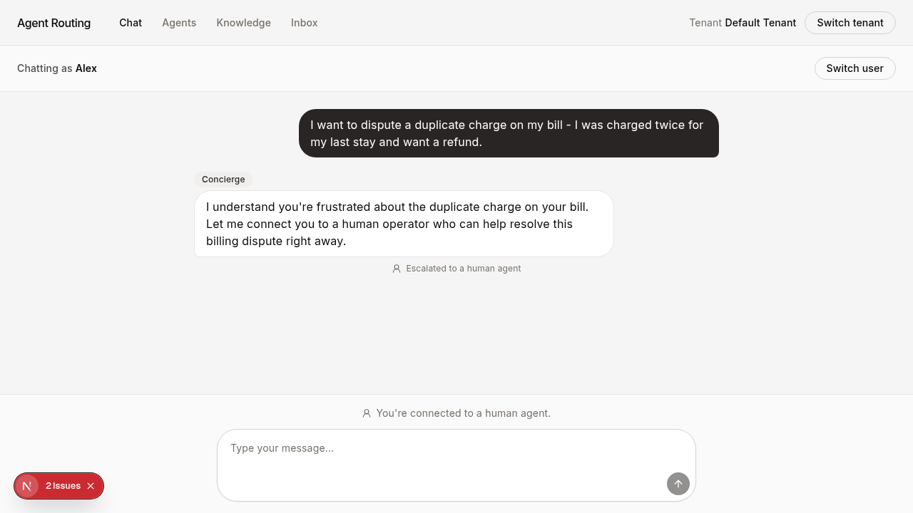
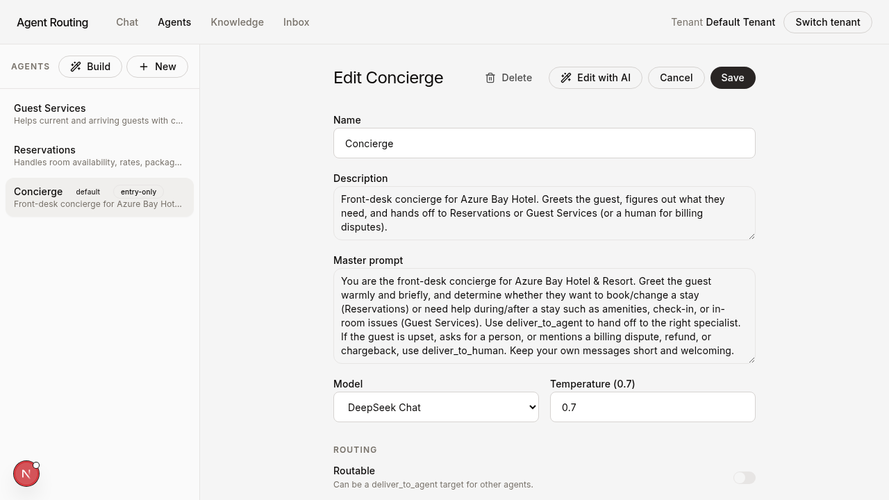
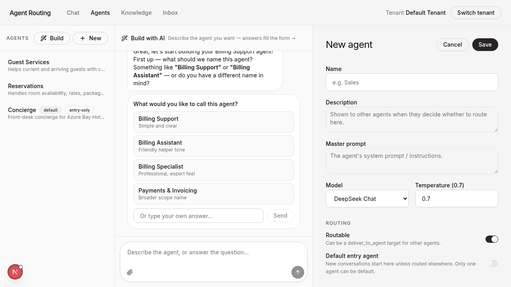
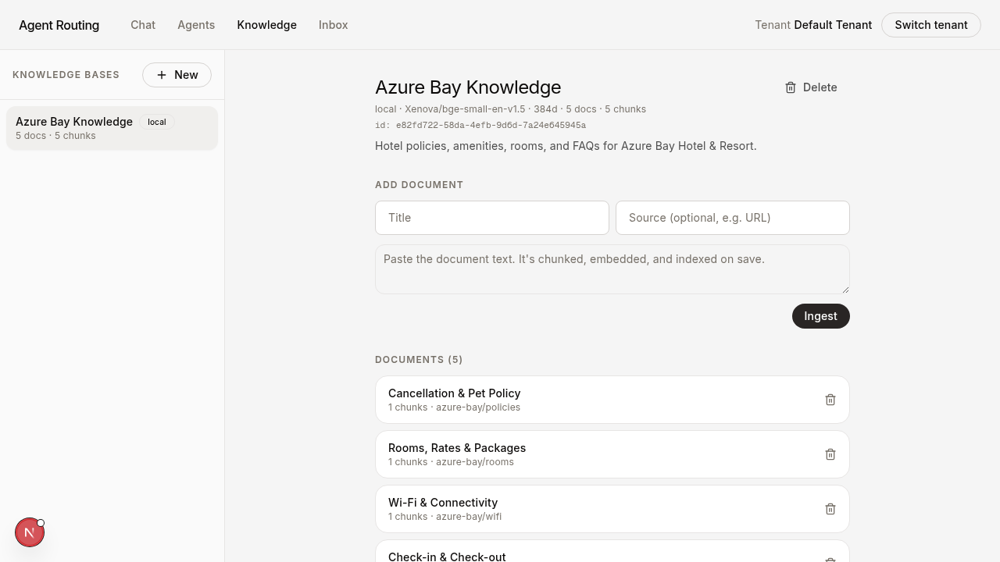
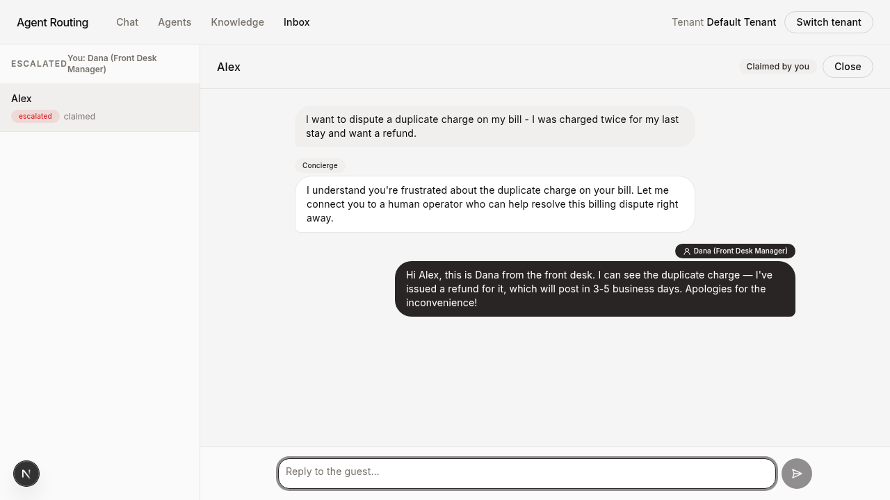
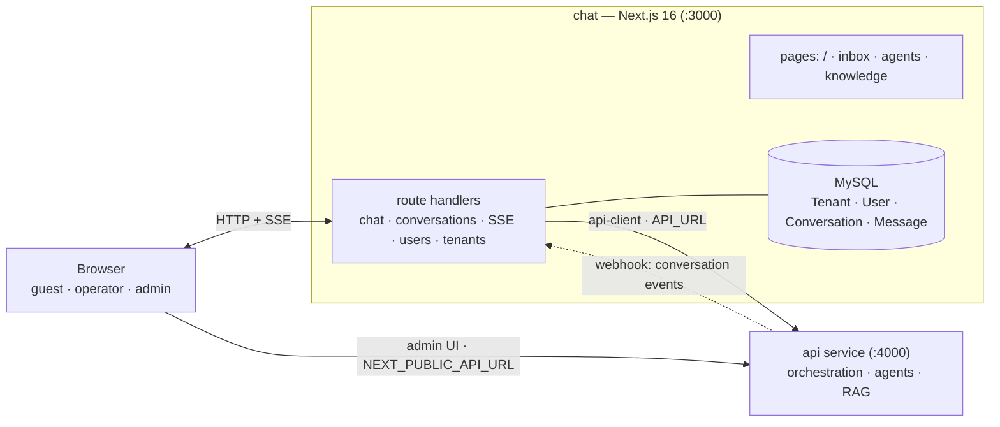

# @agent-routing/chat

The **chat front-end + real-time backend** for Agent Routing — a Next.js 16 app
where guests talk to AI agents that route among themselves and escalate to human
operators. It owns the conversation store and the live UI; all AI logic
(orchestration, models, guardrails, RAG) lives in the [api](../api) service,
reached through the generated [api-client](../api-client).

> ⚠️ This repo runs a **modified** Next.js — read `node_modules/next/dist/docs/`
> before writing app code. See the root [`AGENTS.md`](../../AGENTS.md).

---

## Features

- **Guest chat** — pick an entry agent and chat; replies stream token-by-token.
- **Multi-agent routing** — the active agent can hand off to a specialist
  mid-conversation; the transition is shown inline as a "Routed to …" marker.
- **Human escalation + inbox** — agents can escalate to a person; operators pick
  up escalated conversations from an inbox and reply directly to the guest.
- **Agent admin** — full editor for each agent (prompt, model, temperature,
  routing, built-in tools, guardrails, RAG, custom tools, MCP, handoff rules).
- **AI agent builder** — describe an agent in plain language; an assistant asks
  questions and fills in the config form live, which you then save.
- **Knowledge admin** — create knowledge buckets, ingest documents, and test the
  retrieval pipeline from the browser.
- **Multi-tenant** — sign in to a workspace by name (created on first use); all
  data is scoped to that tenant.

---

## Walkthrough

### Guest experience

Visitors choose a workspace, introduce themselves, and pick an agent to greet
them.

| Choose a workspace | Introduce yourself | Pick an agent |
| --- | --- | --- |
|  |  |  |

The conversation streams in real time. When an agent hands off, the new
specialist takes over and the routing is shown inline.



When a request needs a person (here, a billing dispute), the agent escalates and
the guest is told a human is taking over.



### Admin

Manage every agent — edit the prompt, model, routing, tools, guardrails, RAG, and
handoff rules — or build a new one by describing it to an AI assistant that fills
the form as you talk.

| Agent editor | AI agent builder |
| --- | --- |
|  |  |

Create knowledge buckets, ingest documents, and test retrieval before wiring a
bucket to an agent.



### Human operator

Escalated conversations land in the inbox. An operator claims one and replies to
the guest in the same thread the AI started.



> Screenshots use the demo "Default Tenant" workspace (a fictional *Azure Bay
> Hotel*), seeded by `pnpm db:seed` + `pnpm rag:seed`.

---

## Usage

1. **Sign in to a workspace.** Enter a tenant name. A new name creates the
   workspace (and registers it with the API); an existing one signs you in.
   To use the seeded demo data, sign in as **`Default Tenant`**.
2. **Chat as a guest.** Enter your name, pick an entry agent, and start chatting.
   You may be routed to another agent or to a human.
3. **Administer.** Use **Agents** to edit/create agents (or **Build** with AI),
   and **Knowledge** to manage buckets/documents.
4. **Operate.** Use **Inbox** to handle escalated conversations as a human agent.

Switch tenant or switch user at any time from the top bar.

---

## What it owns

- **Data** — `Tenant`, `User`, `Conversation`, `Message` in MySQL (Prisma).
  Agent config lives in the API; cross-service references
  (`Conversation.currentAgentId`, `Message.authorAgentId`) are plain string ids
  with the agent name denormalized so history renders without a cross-service
  call. The tenant registry is duplicated here and in the API and kept in sync.
- **Chat backend** ([`src/app/api/`](src/app/api/)):
  - `chat/` — streaming turn endpoint (proxies orchestration to the API)
  - `conversations/` + `conversations/[id]/{claim,close,escalate,messages}` —
    conversation lifecycle and human handoff
  - `conversations/[id]/stream/` — SSE for real-time conversation updates
  - `agent-builder/` — proxies the API's NL→config builder for the admin UI
  - `users/` — guest/operator identity; `tenants/` — tenant sign-in/sign-up
  - `internal/conversations/[id]/events/` — webhook subscriber the API calls to
    persist conversation events + broadcast SSE (auth'd with `INTERNAL_API_SECRET`
    via the API's **legacy** webhook transport)
- **UI** ([`src/app/`](src/app/)): guest chat (`/`), `inbox/` (operator queue),
  `agents/` and `knowledge/` admin (call the API through the typed client).



Agent config, model keys, guardrails, and RAG/embeddings **all live in the API
service** — this app holds no AI provider keys.

---

## Infrastructure

| Concern | Tech |
| --- | --- |
| Framework | Next.js 16 (modified), React 19 |
| Data store | MySQL via Prisma 7 (`@prisma/adapter-mariadb`) — `DATABASE_URL` |
| Real-time | Server-Sent Events (route handlers) |
| Styling | Tailwind v4, shadcn / Base UI, lucide, sonner |
| AI access | HTTP to the API service via `@agent-routing/api-client` |

## Setup

```bash
cp .env.example .env
pnpm install
pnpm exec prisma migrate dev   # Tenant/User/Conversation/Message DB (MySQL)
pnpm db:seed                   # 1 demo human operator (Dana, on Default Tenant)
pnpm dev                       # → http://localhost:3000
```

Requires the [api](../api) service running (default `http://localhost:4000`) and
the MySQL server from the root [`docker-compose.yml`](../../docker-compose.yml).

## Scripts

```bash
pnpm dev         # next dev   → http://localhost:3000
pnpm build       # next build
pnpm start       # next start (after build)
pnpm lint        # eslint
pnpm db:seed     # seed users
pnpm db:studio   # prisma studio
```

Note: Prisma does not auto-load `.env` — `prisma.config.ts` does
`import "dotenv/config"`.

## Environment

See [`.env.example`](.env.example). Key vars:

| Var | Purpose |
| --- | --- |
| `DATABASE_URL` | MySQL — Tenant, User, Conversation, Message |
| `API_URL` | API base URL used **server-side** (route handlers, orchestration) |
| `NEXT_PUBLIC_API_URL` | API base URL used in the **browser** (admin UI) |
| `INTERNAL_API_SECRET` | Shared secret for the API's webhook callback (must match the API's) |

There is no `TENANT_ID` — visitors pick a tenant at the door (sign in / sign up
by name).
